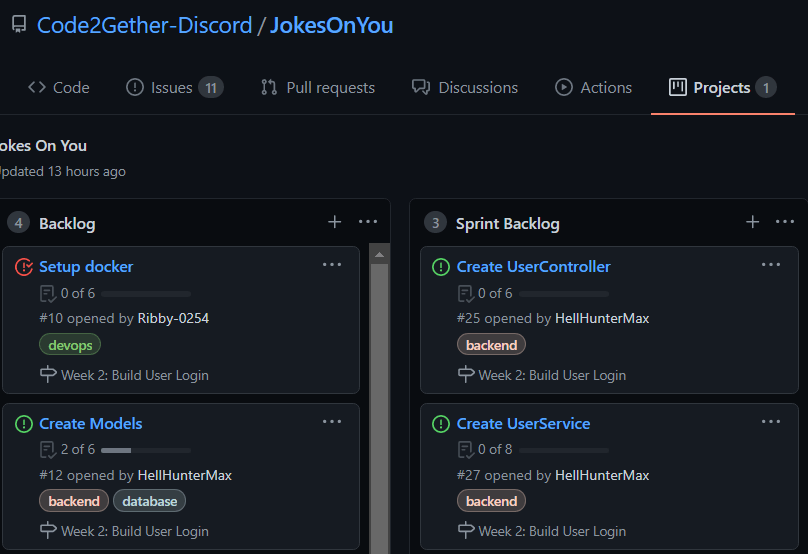

# JokesOnYou

*description of project*
- We formed this project to learn about web development using C# as main Language.
- We will create a website where people can view and rate jokes.
- This should be a learning project for all aspects.
The Building, Coding, Documenting and Teaching.

## Summary

  - [Getting Started](#getting-started)
  - [Running the tests](#running-the-tests)
  - [Deployment](#deployment)
  - [Built With](#built-with)
  - [Contributing](#contributing)
  - [Versioning](#versioning)
  - [License](#license)
  - [Acknowledgments](#acknowledgements)

## Getting Started

Check out the [WIKI](https://github.com/Code2Gether-Discord/JokesOnYou/wiki)!!!!!

1. **Clone** the project from this page to your pc.
2. Use the IDE you prefer Visual studio 2019 or Visual studio code should work best.
3. **Pick an issue** from the list of issues in the project.  

 - The sprint is the issues we would like to get finished before the end of the sprint.
 - Backlog are items that need to be done sometime (now or in the future)
 - Backlog is where all new issues (if assigned to the project will start in)
4. Assign yourself as **Assignee**.
5. Move the card into **In Progress**
6. In your IDE or Git manager create a new branch based of **dev**
7. Name it as discussed in the wiki page [How To BackLog](https://github.com/Code2Gether-Discord/JokesOnYou/wiki/How-To-Backlog)
8. **Start** working on it!
9. When done with working for the day **push** your branch to the github. (so other people might continue where you left off)
10. When fully done with the issue Make a **Pull-Request** (PR) and make sure you target dev branch.

### Prerequisites

1. Any type of IDE:
 - [Visual Studio 2019](https://visualstudio.microsoft.com/downloads/)
 - [Visual Studio Code](https://code.visualstudio.com/download)
 - [Discord](https://discord.com/download)
2. Join the Code Together Discord Group : [Join Here](https://discord.gg/fkksvX7YPR)

### Installing

*Step-by-step instructions on how to get dev environment running*

## Running the tests
*Explain how to run the automated tests for this system*

## Deployment
*Explain how to deploy this on a live system*

## Built With
- .Net Core 5
- Asp.Net Core
- SQLite
- Entity Framework Core (EF)
- Xunit
- Angular

## Contributing
```
Do you see something that you think:
- Should be different.
- Has a better way of beeing done.
- needs more.
- needs less.
- or needs refactoring.
```

We are a Learning community and we love to hear about it!
- Reach out on Discord.
- Start an issue in the project.
- start discussing with us here in the project discussions.
- give tips


*place link to CONTRIBUTING.md*

## Versioning
Every sprint will be for 1-2  weeks. we will review what we made and how it fits in the project.
everyone is welcome to join in and discuss.


## License

## Acknowledgements
